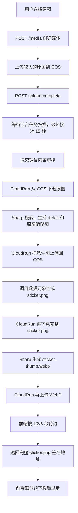
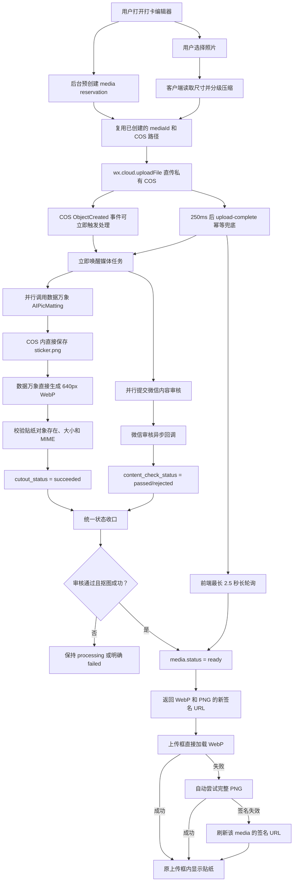

# 打卡贴纸上传链路优化说明

更新时间：2026-07-24

## 1. 文档范围

本文说明打卡照片从用户选择图片到贴纸显示的完整链路，以及最初实现与当前实现之间的差异。

本文的“贴纸链路”主要指 `purpose = record_photo` 的打卡照片。账户头像使用相同的媒体上传入口，但当前不执行 AIPicMatting：头像会在客户端压缩后上传，后端将原图对象直接作为头像展示资源。

打卡贴纸只有同时满足以下条件才允许显示和保存：

```text
内容审核通过
AND 抠图成功
AND 贴纸对象存在且可读取
AND 前端图片加载成功
```

## 2. 最初的对象存储路径

媒体对象原本计划统一放在以下目录：

```text
media/{userId}/{mediaId}/original.jpg
media/{userId}/{mediaId}/detail.webp
media/{userId}/{mediaId}/sticker.png
media/{userId}/{mediaId}/sticker-thumb.webp
```

例如用户 `1` 的媒体 `14`：

```text
media/1/14/original.jpg
media/1/14/sticker.png
```

早期调用数据万象时，`fileid` 使用了相对路径：

```text
media/1/14/sticker.png
```

数据万象会相对当前原图目录解析该值，因此实际生成成了：

```text
media/1/14/media/1/14/sticker.png
```

数据库和前端查询的却是：

```text
media/1/14/sticker.png
```

这就是早期出现 `The specified key does not exist` 的直接原因。

## 3. 当前的对象存储路径

当前每个媒体只使用一个固定目录：

```text
media/{userId}/{mediaId}/
```

目录内的正式对象为：

| 对象 | 路径 | 用途 |
| --- | --- | --- |
| 上传源图 | `original.jpg` | 安全审核和数据万象输入 |
| 完整贴纸 | `sticker.png` | 透明 PNG 原始成品和加载兜底 |
| 展示贴纸 | `sticker-thumb.webp` | 上传框、日历和列表优先加载 |

示例：

```text
media/1/38/original.jpg
media/1/38/sticker.png
media/1/38/sticker-thumb.webp
```

数据万象输出路径现在强制从存储桶根目录开始：

```typescript
fileid: `/${keys.sticker.replace(/^\/+/, '')}`
```

缩略贴纸同样使用根路径：

```typescript
fileid: `/${keys.stickerThumbnail.replace(/^\/+/, '')}`
```

这样不会再把媒体目录重复拼接到自身下面。

## 4. 最初的完整处理链路



### 最初链路的主要问题

1. 媒体创建发生在用户选图之后，创建接口本身位于关键路径。
2. 原图或较大压缩图上传耗时较长；后端允许最大 10MB。
3. 后台任务主要依赖 15 秒周期扫描，新任务可能等待下一次扫描。
4. 审核任务提交完成后才开始抠图，没有完全并行。
5. 原图和贴纸在 COS 与 CloudRun 之间多次下载、上传。
6. CloudRun 使用 Sharp 生成多个派生文件，增加 CPU、内存和网络耗时。
7. 前端轮询可能刚好错过状态变化，多等待一个轮询周期。
8. 前端优先使用完整透明 PNG，示例中完整贴纸达到约 1.8MB。
9. 前端把 `wx.getImageInfo` 预下载失败误判成贴纸生成失败。
10. COS 临时凭证的旧 `StartTime` 被重复用于新签名，可能返回已经过期的 URL。

## 5. 当前优化后的完整链路



## 6. 客户端上传优化

### 6.1 媒体预创建

用户打开新建打卡编辑器或图片来源面板时，前端提前请求：

```http
POST /api/v1/media/reservations
```

提前得到：

```text
mediaId
media/{userId}/{mediaId}/original.jpg
```

用户选择图片后直接复用 reservation。预创建失败时才回退到普通 `POST /media`。

解决的问题：把媒体创建接口从用户选择图片后的关键路径中移出，同时保持失败可回退。

### 6.2 分级压缩

当前打卡图片参数：

| 阶段 | 最长边 | JPEG quality |
| --- | ---: | ---: |
| 第一档 | 720px | 68 |
| 第二档 | 640px | 58 |
| 第三档 | 560px | 50 |

目标大小：

```text
约 180KB
硬上限 512KB
```

账户头像参数：

| 阶段 | 最长边 | JPEG quality |
| --- | ---: | ---: |
| 第一档 | 512px | 76 |
| 第二档 | 448px | 66 |

目标大小约 160KB。

历史上的第一轮性能优化只压到最长边 1440px、quality 80、上限 1MB；当前参数进一步面向“上传后只用于贴纸生成和小尺寸展示”的实际用途收紧。

解决的问题：减少客户端上行流量和数据万象解码像素量。复杂照片的内容复杂度仍会影响 JPEG 体积，因此采用多档压缩而不是固定一次压缩。

### 6.3 直接上传 COS

图片仍通过：

```typescript
wx.cloud.uploadFile({ cloudPath, filePath })
```

直接上传私有 COS，不经过 CloudRun 请求体转发。

解决的问题：避免图片先上传到应用服务器，再由应用服务器上传 COS 的双倍网络开销。

## 7. 后台处理优化

### 7.1 事件触发加客户端兜底

当前支持两种幂等触发方式：

1. COS `ObjectCreated` 事件触发 `/internal/storage/object-created`。
2. 客户端上传完成 250ms 后调用 `/media/{mediaId}/upload-complete`。

任何一个先成功，都会把媒体推进到 `processing`；另一个到达时只会被识别为重复请求。

解决的问题：正常情况下不再等待 15 秒周期扫描；COS 事件未配置或丢失时仍能由客户端确认兜底。

### 7.2 审核与抠图并行

旧链路：

```text
提交审核任务
→ 开始抠图
```

当前链路：

```text
上传完成
├── 提交内容审核
└── 执行数据万象抠图
```

最终耗时由较慢的一支决定：

```text
max（审核耗时, 抠图耗时）
```

而不是把两段耗时相加。

### 7.3 去除 CloudRun 图片中转

旧链路会执行：

```text
COS 下载原图到 CloudRun
→ Sharp 生成派生图
→ 上传派生图
→ 数据万象抠图
→ 下载完整贴纸到 CloudRun
→ Sharp 生成 WebP
→ 再上传 WebP
```

当前链路：

```text
COS original.jpg
→ 数据万象直接生成 sticker.png
→ 数据万象直接生成 sticker-thumb.webp
→ HEAD 校验输出
```

解决的问题：去除两次大文件下载、两次应用层上传和 Sharp 处理，减少 CloudRun CPU、内存、网络与失败点。

### 7.4 状态独立并统一收口

当前分别记录：

```text
cutout_status
content_check_status
media.status
```

只有以下条件成立才写入 `ready`：

```text
cutout_status = succeeded
AND content_check_status = passed
```

审核回调和抠图任务无论谁先完成，都会根据同一条件尝试收口。

解决的问题：避免“贴纸已经存在但状态一直 processing”，也避免只完成抠图就提前显示未经审核的图片。

## 8. 前端等待和展示优化

### 8.1 长轮询替代固定间隔轮询

前端查询：

```http
GET /api/v1/media/{mediaId}?waitMs=2500
```

后端最多等待 2.5 秒；期间一旦状态成为 `ready`、`failed` 或 `abandoned` 就立即返回。

解决的问题：减少大量短轮询请求，同时避免状态刚变化却必须再等 1～5 秒。

### 8.2 原上传框内显示

上传后页面不跳转。上传框依次展示：

```text
正在准备图片
→ 正在上传图片
→ 正在审核并生成贴纸
→ 贴纸
```

处理中不展示本地原图或服务器原图。只有贴纸 ready 后才在原位置显示结果。

### 8.3 WebP 优先、PNG 兜底

后端 ready 后同时返回：

```text
stickerThumbnailUrl  -> sticker-thumb.webp
stickerUrl           -> sticker.png
```

前端先加载 WebP，失败后自动加载完整 PNG。

解决的问题：正常情况下避免下载约 1.8MB 的完整透明 PNG；WebP 异常时仍保留可用成品。

### 8.4 不再使用预下载结果判定“生成成功”

旧实现会先调用 `wx.getImageInfo`，只要预下载失败就把整个媒体任务标成“贴纸生成失败”。

当前以服务端状态判断是否生成成功，以 `<image>` 的真实加载事件判断是否显示成功：

```text
后端 failed       -> 贴纸生成失败
后端 ready + 403  -> 刷新签名
WebP 无法加载     -> 尝试 PNG
两个资源都失败    -> 贴纸加载失败
```

解决的问题：生成失败、审核失败和图片加载失败不再混为同一种错误。

### 8.5 COS 签名刷新

后端现在每次 COS 请求都按当前时间计算 Authorization，不再复用临时凭证最初的 `StartTime`。

前端若仍遇到资源加载失败，会重新请求：

```http
GET /api/v1/media/{mediaId}
```

获取同一对象的新签名 URL，不重新上传、不重新审核、不重新抠图。

解决的问题：避免对象已经存在但旧签名 URL 返回 403。

## 9. 优化前后对比

| 环节 | 最初实现 | 当前实现 | 直接收益 |
| --- | --- | --- | --- |
| 媒体创建 | 选图后创建 | 打开编辑器时预创建 | 移出关键路径 |
| 上传文件 | 原图或较大图片 | 约 180KB 分级压缩图 | 减少上行时间 |
| 后台启动 | 最坏等待 15 秒扫描 | COS 事件/接口立即唤醒 | 消除队列空等 |
| 审核与抠图 | 先提交审核再抠图 | 两者并行 | 减少后台关键路径 |
| 图片处理 | CloudRun 多次下载、Sharp、上传 | COS 数据万象云内处理 | 减少网络、CPU和失败点 |
| 贴纸路径 | 相对路径可能嵌套 | 存储桶根绝对路径 | 消除对象不存在错误 |
| 状态查询 | 固定 1/2/5 秒轮询 | 最长 2.5 秒长轮询 | 更快感知完成状态 |
| 首屏贴纸 | 完整 PNG | 640px WebP | 降低下载体积 |
| 加载失败 | 误报生成失败 | PNG兜底、刷新签名 | 错误分类准确，可自动恢复 |
| 页面流程 | 曾出现独立生成页 | 原上传框内更新 | 符合既定交互 |

## 10. 当前性能边界

当前总耗时可近似为：

```text
客户端压缩
+ 压缩图上传
+ max（内容审核, 数据万象抠图和缩略图生成）
+ WebP 下载与渲染
```

已经消除或缩短的等待包括：

```text
媒体创建等待
15 秒任务扫描等待
审核与抠图串行等待
CloudRun 图片下载/上传中转
固定轮询额外等待
完整 PNG 的常规下载
过期签名导致的人工重试
```

线上日志中，图片上传完成后的审核提交、抠图和状态收口曾在约 1.3 秒内完成。端到端是否能稳定低于 2 秒仍受客户端压缩、用户网络、微信云上传和第三方服务时延影响，不能只靠后端代码保证。

## 11. 验收清单

每次修改媒体链路后，必须用同一个 `mediaId` 验证以下项目：

- [ ] reservation 或 `/media` 返回唯一媒体 ID。
- [ ] 原图只存在于 `media/{userId}/{mediaId}/original.jpg`。
- [ ] `upload-complete` 或 COS 事件成功推进到 processing。
- [ ] 审核任务和抠图任务都已启动。
- [ ] `sticker.png` 位于正确目录，没有嵌套路径。
- [ ] `sticker-thumb.webp` 存在、大小大于零且 MIME 为图片。
- [ ] `cutout_status = succeeded`。
- [ ] `content_check_status = passed`。
- [ ] 最终 `media.status = ready`。
- [ ] WebP 请求返回 200。
- [ ] WebP 失败时 PNG 可以自动兜底。
- [ ] 签名过期时只刷新 URL，不重新生成贴纸。
- [ ] 贴纸只在原上传框显示，不发生页面跳转。
- [ ] 用户能够保存打卡，日历和详情页显示同一贴纸。

## 12. 相关实现

- 客户端准备、上传和状态等待：`src/services/remote-api.ts`
- 上传框状态和资源兜底：`src/pages/module-detail/index.ts`
- 媒体创建与查询：`server/src/routes/media.ts`
- COS 事件入口：`server/src/routes/storage-events.ts`
- 审核与抠图任务：`server/src/jobs/runner.ts`
- 数据万象处理和 COS 签名：`server/src/services/storage.ts`
- 微信审核回调：`server/src/routes/wechat-events.ts`

