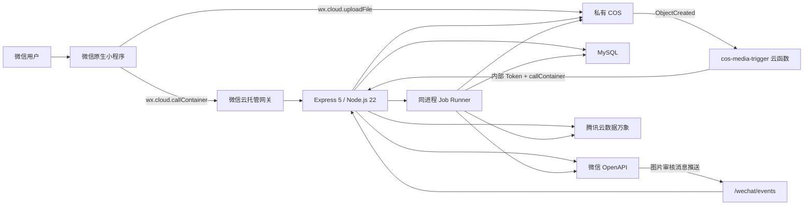
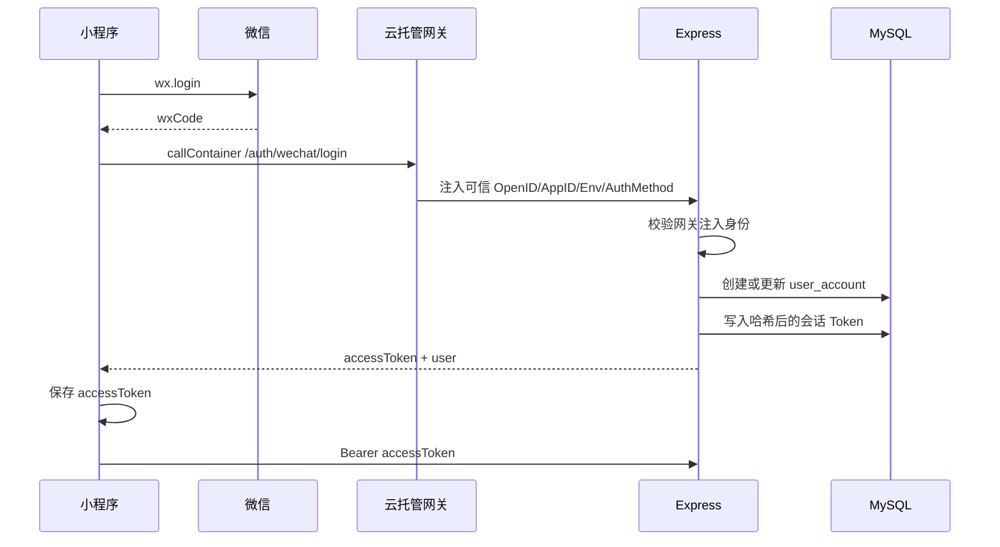
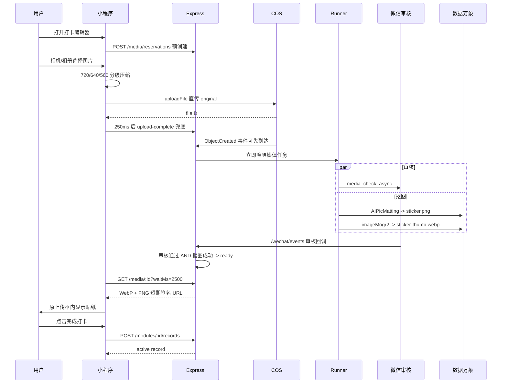

# 《记录我的一辈子》项目当前状态与企业级交接报告

> 报告日期：2026-07-25  
> 扫描对象：`E:\hqw\workspace\打卡小程序` 当前本地工作区  
> 项目阶段标识：小程序 `0.3.0-rc.1`、后端 `0.1.0`、COS 触发函数 `1.0.0`  
> 需求基线：PRD V6.4、页面流程 V6.4、数据库/接口/状态机/埋点 V1.1、Figma 原型  
> 文档性质：现状审计、技术交接、部署运维交接、风险清单和后续路线基线  
> 保密说明：本文不记录数据库密码、Access Token、回调 Token、临时密钥或用户隐私数据。

---

## 1. 执行摘要

### 1.1 一句话结论

本项目已经形成可运行的微信原生小程序 RC：核心产品闭环、真实云托管后端、MySQL 业务数据库、COS 私有对象存储、数据万象抠图、微信内容安全回调、多人协作、补卡审批、通知提醒、回忆导出、回收站和账号删除均有代码实现；当前本地代码能够通过类型检查、单元测试、生产构建和产物隔离校验。

但是，项目目前更准确的企业级状态是：

```text
产品功能代码：RC，可继续真机验收
本地工程质量：通过现有自动化检查
生产环境状态：已有实际运行记录，但本次扫描未重新读取云端配置和在线版本
发布成熟度：以手工部署和 ZIP 包为主，尚不可重复、不可审计
运维成熟度：有日志和健康检查，缺少指标、告警、SLO、备份演练和标准事故流程
安全成熟度：主后端基线较好，但 COS 触发云函数存在高危依赖告警
版本治理：当前最严重的基础问题，无可用 Git 历史，线上版本与本地源码无法可靠对应
```

### 1.2 当前交付判定

| 维度 | 状态 | 判定 |
| --- | --- | --- |
| 核心业务闭环 | 已实现 | 创建模块、上传图片、生成贴纸、打卡、查看、编辑、删除可形成闭环 |
| 多人协作 | 已实现 | 邀请、申请、审批、成员上限、转让、移除、退出均有实现 |
| 媒体生产链路 | 已实现并经过多轮修复 | 当前采用客户端压缩、COS 直传、审核与抠图并行、WebP 优先 |
| 隐私与数据生命周期 | 已实现主要逻辑 | 隐私同意、7 天删除冷静期、模块回收、媒体清理均有实现 |
| 自动化构建 | 已实现本地命令 | 生产构建与静态校验通过 |
| 自动化测试 | 已实现部分 | 78 项测试通过，但缺真机、真实微信/COS、并发和压测 |
| 自动化发布 | 未实现 | 仍依赖控制台、本地上传和手工 ZIP |
| 基础设施即代码 | 未实现 | COS 触发器、云托管配置和消息推送配置未被仓库完整描述 |
| 监控告警 | 部分实现 | 有结构化日志和 `/health`，无业务指标、告警策略和仪表盘 |
| 正式发布可追溯性 | 不满足 | `.git` 不可用，发布包与源码时间不一致，无法证明线上提交 |
| 安全依赖治理 | 部分满足 | 主后端无已知审计告警；COS 触发函数有 4 个高危、1 个中危依赖告警 |

### 1.3 接手人最先要做的五件事

1. 立即建立可用 Git 仓库，将当前源码、数据库迁移和本报告作为首个受控基线。
2. 从云托管控制台导出或人工登记当前线上版本、环境变量、实例规格、触发器和消息推送配置。
3. 用同一提交重新生成小程序与后端发布产物，并记录 SHA-256、版本号、部署时间和回滚包。
4. 处理 `cloudfunctions/cos-media-trigger` 的高危依赖，升级或替换后完成回归测试。
5. 执行一次真实环境端到端验收：登录、打卡贴纸、内容审核回调、邀请、订阅提醒、回忆导出、删除恢复。

---

## 2. 报告依据与可信度边界

### 2.1 本次实际检查内容

本报告基于以下证据生成：

- 当前工作区全部业务源码、配置、迁移、测试和文档；
- 小程序 14 个注册页面、公共组件、自定义 TabBar 和服务适配层；
- 后端 71 个生产路由定义、1 个健康检查和 2 个本地存储路由；
- 27 张业务/运行表迁移，以及运行时自动创建的 `schema_migration` 表；
- 后台任务、Outbox、内容审核回调、COS 触发函数和数据万象调用；
- 根项目生产验证命令；
- 后端独立验证命令；
- 三个 Node.js 子项目的依赖审计；
- `release/` 中现存发布包的名称、时间和内容结构。

### 2.2 已执行的验证

2026-07-25 本地执行结果：

| 验证项 | 结果 |
| --- | --- |
| 小程序 TypeScript 类型检查 | 通过 |
| 小程序及根目录测试 | 19 个测试文件、78 项测试全部通过 |
| 小程序生产模式构建 | 通过，API 模式为 `remote` |
| 小程序构建产物校验 | 通过，14 个页面、118 个产物 |
| 生产包本地/Mock 隔离校验 | 通过 |
| 隐私弹窗页面覆盖校验 | 通过，14 个注册页面均包含隐私组件 |
| 后端 TypeScript 类型检查 | 通过 |
| 后端测试 | 11 个测试文件、40 项测试全部通过 |
| 后端编译 | 通过 |
| 根项目依赖审计 | 0 个已知漏洞 |
| 后端生产依赖审计 | 0 个已知漏洞 |
| COS 触发云函数依赖审计 | 未通过：4 个高危、1 个中危 |

### 2.3 本次没有验证的内容

以下项目需要云控制台、真机、真实用户授权或生产数据，本次仅扫描本地工作区，不能声明已经通过：

- 当前云端正在运行的确切容器版本；
- 当前线上环境变量是否与源码要求完全一致；
- COS ObjectCreated 触发器是否仍启用、过滤条件是否正确；
- 微信内容审核 JSON 回调在新图片上的实际到达率和延迟；
- 传统 XML 消息推送配置是否可通过控制台路径检查；
- 订阅消息模板剩余次数、实际送达率和拒绝状态；
- 数据万象权限、配额、计费、失败率和 P95/P99；
- MySQL 备份、恢复、容量、慢查询和线上版本；
- 真机兼容性、弱网、后台切换、杀进程恢复和小程序审核；
- 生产并发、峰值容量、长时间稳定性和故障恢复；
- 账号删除涉及的全部合规要求是否经法务确认。

### 2.4 状态用语定义

| 用语 | 定义 |
| --- | --- |
| 已实现 | 当前源码存在完整业务路径，且可通过类型检查/测试或静态验证 |
| 部分实现 | 存在主要代码，但仍有降级、占位、未接入或缺少生产验证 |
| 已验证 | 本次实际执行命令或有明确线上结果支持 |
| 待云端验证 | 本地无法证明，需要进入微信/腾讯云控制台或真机验证 |
| 未实现 | 当前源码没有对应生产能力，或仅有产品占位 |
| 技术债 | 不阻塞当前基础功能，但会降低维护、扩展、稳定或审计能力 |

---

## 3. 项目概览

### 3.1 产品定位

“记录我的一辈子 / NoteMyLife”是熟人小范围共同记录的小程序。用户创建一个记录模块，每天上传一张照片，服务端对图片执行内容安全检查和主体抠图，生成透明贴纸，并在首页、月历、日期详情、图片合集和月度回忆中展示。

MVP 明确面向 1 至 4 人模块，不是公开社区。发现 Tab 当前仅保留入口和下一版本预告。

### 3.2 核心业务对象

```text
用户 User
  └── 参与模块 Module
        ├── 成员实例 MemberInstance
        ├── 每日记录 Record
        │     ├── 媒体 MediaAsset
        │     └── 回应 Reaction
        ├── 邀请 Invite / 加入申请 JoinApplication
        ├── 补卡审批 MakeupApproval
        ├── 通知 Notification / 模块待办 Inbox
        ├── 提醒 ReminderSubscription
        ├── 每日快照 DailySnapshot
        └── 月度回忆 MonthlyMemoryCard
```

### 3.3 当前规模

| 指标 | 当前值 |
| --- | ---: |
| 小程序注册页面 | 14 |
| 小程序 TypeScript 文件 | 38 |
| 小程序 TypeScript 代码行 | 约 6,973 |
| WXML 文件/行 | 16 / 约 511 |
| WXSS 文件/行 | 18 / 约 2,542 |
| 后端 TypeScript 文件 | 33 |
| 后端 TypeScript 代码行 | 约 6,069 |
| 根测试文件/测试行 | 8 / 约 553 |
| 后端测试文件/测试行 | 11 / 约 705 |
| SQL 迁移文件/行 | 3 / 约 597 |
| 生产路由定义 | 71，加 `/health` 共 72 |
| 本地开发专用路由 | 2 |
| 迁移定义业务/运行表 | 27 |
| 运行时数据库总表 | 28，含 `schema_migration` |
| 种子模块模板 | 4 |
| 当前 `release/` 文件 | 31 |

### 3.4 当前环境标识

以下标识不是密钥，但修改前必须评估跨环境影响：

| 配置 | 当前值 |
| --- | --- |
| 微信小程序 AppID | `wxa64faf2abab7e388` |
| 云环境 ID | `prod-d5g4tznceeecbaf39` |
| 云托管服务名 | `express-bonj` |
| COS 桶 | `7072-prod-d5g4tznceeecbaf39-1346314817` |
| COS 地域 | `ap-shanghai` |
| 后端监听端口 | `8080` |
| 健康检查 | `GET /health` |
| API 前缀 | `/api/v1` |
| 业务时区 | `Asia/Shanghai` |

---

## 4. 技术栈

### 4.1 小程序前端

| 分类 | 技术/实现 |
| --- | --- |
| 客户端 | 微信原生小程序，不使用 React/Vue/Taro/uni-app |
| 语言 | TypeScript 5.8 |
| 模板与样式 | WXML、WXSS |
| 构建 | esbuild 0.25，自定义 `scripts/build.mjs` |
| 测试 | Vitest 3.2 |
| 类型 | `miniprogram-api-typings` |
| 图标 | `lucide-static` 生成/复用的静态 SVG |
| 图片处理 | 微信 `wx.compressImage`；构建脚本依赖 Sharp |
| 云调用 | `wx.cloud.callContainer` |
| 文件上传 | `wx.cloud.uploadFile` 直传云存储 |
| 本地持久化 | `wx.getStorageSync` / `wx.setStorageSync` |
| 导航 | 原生页面路由 + 自定义 TabBar |
| 隐私授权 | 全局 `privacy-dialog` 组件 |

### 4.2 后端

| 分类 | 技术/实现 |
| --- | --- |
| 运行时 | Node.js 22；`package.json` 最低要求 Node.js 20 |
| Web 框架 | Express 5.1 |
| 语言 | TypeScript 5.8，目标 ES2022/CommonJS |
| 参数校验 | Zod 4 |
| 数据库驱动 | mysql2/promise 3.14 |
| 日志 | Pino 9 + pino-http 10 |
| HTTP 安全头 | Helmet 8 |
| XML 解析 | fast-xml-parser 5 |
| COS | cos-nodejs-sdk-v5 3 |
| 服务端图片处理 | Sharp 0.35，主要用于邀请/月度回忆等生成，不再位于打卡抠图关键链路 |
| 部署 | 微信云托管容器，Docker 多阶段构建 |
| 数据库 | 代码和云托管注释以 MySQL 5.7 兼容为基线 |
| 迁移 | 自研按文件顺序执行、SHA-256 校验、MySQL 命名锁 |
| 后台任务 | 与 Express 同进程的 15 秒 Runner + 立即唤醒 |
| 可靠任务 | MySQL Outbox + 重试 + 定时任务抢占表 |

### 4.3 云服务和第三方能力

| 能力 | 服务 |
| --- | --- |
| 应用托管 | 微信云托管 / CloudBase Run |
| 业务数据库 | 微信云托管 MySQL |
| 私有对象存储 | 腾讯云 COS |
| 自动抠图 | 腾讯云数据万象 `AIPicMatting` |
| 贴纸缩略图 | 数据万象 `imageMogr2` 生成 WebP |
| 图片内容安全 | 微信 `media_check_async` |
| 文字内容安全 | 微信 `msg_sec_check` |
| 订阅提醒 | 微信订阅消息 `subscribeMessage.send` |
| 邀请二维码 | 微信 `getUnlimitedCode` |
| COS 事件转发 | CloudBase 云函数 `cos-media-trigger` |

### 4.4 未采用的基础设施

当前代码中没有以下组件：

- Redis；
- Kafka/RabbitMQ/独立消息队列；
- Kubernetes 自建集群；
- 独立 Worker 服务；
- CDN 配置代码；
- Sentry/APM；
- Prometheus/Grafana；
- Terraform/Pulumi/CloudFormation；
- OpenAPI 自动生成；
- ESLint/Prettier 统一检查流水线；
- 独立 staging 环境配置。

---

## 5. 仓库结构与所有权边界

```text
打卡小程序/
├── src/                         微信小程序源代码
│   ├── app.ts/app.json/app.wxss 应用入口、页面注册、全局样式
│   ├── pages/                   14 个注册页面及 2 个空旧目录
│   ├── components/              公共头部、隐私弹窗
│   ├── custom-tab-bar/          四 Tab 自定义导航
│   ├── services/                远端/本地 API、传输、Mock 数据、埋点
│   ├── types/                   领域模型和全局类型
│   ├── utils/                   日期、动画、轮询、贴纸描边
│   └── assets/                  图标、贴纸、字体、材质
├── server/                      Express 生产后端
│   ├── src/routes/              HTTP 路由
│   ├── src/services/            COS、微信、权限、幂等、本地存储
│   ├── src/jobs/                Outbox 和定时任务 Runner
│   ├── src/db/                  连接池和迁移执行器
│   ├── migrations/              3 个数据库迁移
│   ├── tests/                   后端单元/契约测试
│   ├── scripts/                 集成冒烟脚本
│   └── Dockerfile               云托管容器构建
├── cloudfunctions/
│   └── cos-media-trigger/       COS ObjectCreated 事件转发函数
├── tests/                       小程序和本地业务契约测试
├── scripts/                     小程序构建、生产校验、本地联调
├── docs/                        PRD、接口、数据库、状态机和专项说明
├── release/                     历史手工 ZIP/预览产物
├── dist/                        当前小程序构建结果，不是源代码
├── mock_image/                  Mock 贴纸素材
├── material/                    设计材质
└── typestyle/                   字体源文件
```

### 5.1 关键文件入口

| 领域 | 文件 |
| --- | --- |
| 小程序入口 | `src/app.ts`、`src/app.json` |
| 生产 API 适配 | `src/services/remote-api.ts` |
| 云托管传输 | `src/services/remote-client.ts` |
| 本地 Mock | `src/services/local-api.ts`、`src/services/database.ts` |
| 打卡编辑和贴纸展示 | `src/pages/module-detail/index.ts` |
| 首页 | `src/pages/home/index.ts` |
| 后端入口 | `server/src/index.ts` |
| 后端装配 | `server/src/app.ts` |
| 配置校验 | `server/src/config.ts` |
| 媒体 API | `server/src/routes/media.ts` |
| 记录 API | `server/src/routes/records.ts` |
| 媒体任务 | `server/src/jobs/runner.ts` |
| COS/数据万象 | `server/src/services/storage.ts` |
| 微信 OpenAPI | `server/src/services/wechat.ts` |
| 微信审核回调 | `server/src/routes/wechat-events.ts` |
| COS 事件入口 | `server/src/routes/storage-events.ts` |
| COS 转发函数 | `cloudfunctions/cos-media-trigger/index.js` |
| 初始数据库 | `server/migrations/001_initial_schema.sql` |
| 贴纸优化说明 | `docs/打卡贴纸上传链路优化说明.md` |

### 5.2 当前代码集中度风险

以下文件承担过多职责，后续修改必须重点回归：

| 文件 | 约行数 | 风险 |
| --- | ---: | --- |
| `src/services/local-api.ts` | 1,842 | Mock、业务规则和测试夹具高度集中 |
| `src/pages/module-detail/index.ts` | 1,140 | 日历、日期面板、编辑器、媒体状态、回应、导航混在一个页面 |
| `src/services/remote-api.ts` | 921 | 所有远端契约、缓存、媒体处理和 DTO 映射集中 |
| `server/src/jobs/runner.ts` | 860 | 媒体、Outbox、提醒、清理、快照、注销集中在单 Runner |
| `server/src/routes/records.ts` | 760 | 打卡、记录、日历、详情、回应集中 |
| `src/pages/home/index.ts` | 760 | 首页、回忆和个人资料存在较多复合逻辑 |

---

## 6. 总体系统架构



### 6.1 架构特征

1. 小程序不直接访问 MySQL；全部业务通过云托管 REST API。
2. 图片二进制不经过 Express，客户端直接上传 COS。
3. Express 负责签发路径、鉴权、状态机和任务调度，不承担打卡图片中转。
4. 媒体处理由 COS 事件或客户端 `upload-complete` 双触发，均设计为幂等。
5. 图片审核和抠图并行执行，最终由数据库状态收口。
6. 后台任务与 API 位于同一容器进程，要求至少一个常驻实例。
7. MySQL 同时承担业务事实库、任务队列、幂等快照和定时任务锁。

### 6.2 单点与耦合

- 云托管服务既是 API，又是 Worker；服务缩容到 0 时定时任务停止。
- MySQL 是业务和任务共同依赖，数据库故障会同时影响 API、媒体、提醒和清理。
- 内容审核回调决定媒体能否进入 `ready`，回调配置错误会表现为贴纸已生成但一直处理中。
- COS 临时凭证和数据万象权限错误会同时影响签名、抠图、缩略图和导出。
- 当前没有独立队列积压监控，Outbox 异常主要依赖日志和数据库人工查询。

---

## 7. 小程序前端架构

### 7.1 页面清单

| 页面 | 路由 | 当前能力 | 状态 |
| --- | --- | --- | --- |
| 首页 | `pages/home/index` | 置顶/普通模块、管理态、创建模块、贴纸预览 | 已实现 |
| 回忆 | `pages/memory/index` | 周概览、月度卡片、换一组、保存相册 | 已实现 |
| 发现 | `pages/discover/index` | 下一版本预告 | 占位，符合当前 PRD |
| 我的 | `pages/profile/index` | 资料、头像、通知、隐私、回收站 | 已实现 |
| 模块详情 | `pages/module-detail/index` | 月历、日期详情、打卡编辑、贴纸、回应 | 已实现 |
| 成员管理 | `pages/member-management/index` | 邀请、转让、移除 | 已实现 |
| 邀请分享 | `pages/invite-share/index` | 邀请卡、小程序分享、保存相册 | 已实现 |
| 邀请落地 | `pages/invite-intro/index` | 预览、提交加入申请 | 已实现 |
| 模块设置 | `pages/module-settings/index` | 名称说明、提醒、退出、删除 | 已实现 |
| 通知中心 | `pages/notifications/index` | 列表、已读、加入审批 | 已实现 |
| 模块待办 | `pages/module-todo/index` | 待办、补卡审批 | 已实现 |
| 图片合集 | `pages/module-gallery/index` | 按月、贴纸预览、回日期 | 已实现 |
| 回收站 | `pages/recycle-bin/index` | 7 天倒计时、恢复 | 已实现 |
| 隐私 | `pages/privacy/index` | 隐私说明、注销申请、撤销 | 已实现 |

`src/pages/checkin-processing` 和 `src/pages/checkin-result` 是空目录，未注册到 `app.json`，属于旧方案遗留，应在版本基线确定后删除或写明保留原因。

### 7.2 API 模式

构建脚本强制显式选择三种模式：

| 模式 | 命令 | 适用场景 |
| --- | --- | --- |
| `remote` | `npm run dev` / `npm run build` | 微信云托管生产联调，默认模式 |
| `local` | `npm run dev:mock` | 完全本地 Mock，无真实后端 |
| `dev-server` | `npm run dev:local-backend` | 本机 Express + Docker MySQL |

生产构建会排除 `local-api.js` 和 `database.js`，校验脚本会阻止 Mock 文案、本地适配器和 Source Map 进入正式产物。

### 7.3 登录和会话恢复



重要说明：后端当前不使用 `wxCode` 自行调用 `code2session`，而是信任云托管网关注入的 `x-wx-openid` 等请求头。如果未来迁出微信云托管，该登录方式不能直接复用，必须增加微信登录换取身份的服务端实现。

### 7.4 客户端状态管理

项目没有独立全局状态库。当前方式是：

- App `globalData` 仅保存状态栏高度；
- 页面内部 `data` 保存 UI 状态；
- `remote-api.ts` 维护用户、模块、记录、审批和计数缓存；
- Token、隐私状态、回忆选择等使用微信本地存储；
- 页面通过 `onShow` 重新加载关键数据。

优点是依赖少；缺点是缓存失效规则分散，复杂页面容易出现重复加载和状态漂移。

### 7.5 客户端埋点现状

`src/services/tracker.ts` 将事件写入本地键 `notemylife.alpha.events.v1`，最多保留约 200 条。

当前结论：

- 页面和核心操作已经埋点；
- 埋点不会阻断业务；
- 没有上传服务器、批量发送、失败重试或数据分析平台接入；
- 当前埋点只能用于单机调试，不能用于生产指标、漏斗或留存分析。

因此“埋点事件定义已实现”不等于“生产数据分析已上线”。

---

## 8. 后端架构

### 8.1 启动流程

```text
1. 读取并校验环境变量
2. 立即监听 0.0.0.0:8080，启动阶段返回 503 starting
3. 可选执行数据库迁移
4. 创建 MySQL 连接池并执行 SELECT 1
5. 生产环境创建 COS StorageService；非生产创建 LocalStorageService
6. 创建 WechatService
7. 启动同进程 Job Runner
8. 装配 Express 路由
9. 切换到正式请求处理器并记录 server ready
```

该设计避免容器启动期间端口未监听，但数据库或迁移失败时服务最终会退出。

### 8.2 HTTP 公共能力

- `helmet` 安全头；
- 禁用 `x-powered-by`；
- 代理信任级别为 1；
- 每个请求生成或继承请求 ID；
- Pino JSON 结构化日志；
- Authorization、OpenID、CloudBase Context 等请求头脱敏；
- 邀请密钥在日志 URL 中替换为 `[REDACTED]`；
- JSON/XML 请求体上限 1MB；
- Zod 参数校验；
- 统一成功/失败响应；
- 未知错误对用户返回通用错误文案；
- 优雅停机最多等待 10 秒。

### 8.3 鉴权与授权

鉴权分为两层：

1. 登录鉴权：Bearer Token 在数据库中只保存 SHA-256 哈希，默认有效期 7,200 秒。
2. 资源授权：路由调用 `requireMember` 检查模块、成员、角色和模块状态。

生产环境明确禁止 `ALLOW_DEV_AUTH=true`。本地开发可通过 `X-Dev-OpenId` 模拟多用户。

### 8.4 幂等

写接口普遍使用：

```text
userId + requestType + clientRequestId
```

幂等服务会：

- 对请求体做规范化 JSON 和 SHA-256；
- 首次执行时锁定并保存结果快照；
- 相同 ID、相同请求返回之前结果；
- 相同 ID、不同请求体返回 `IDEMPOTENCY_CONFLICT`；
- 处理中重复请求返回 `REQUEST_IN_PROGRESS`；
- 幂等记录保留 7 天后清理。

### 8.5 后台任务模型

Runner 每 15 秒执行一次，同时业务代码可以立即 `wake()`。任务类别：

| 任务 | 频率/触发 | 作用 |
| --- | --- | --- |
| 媒体处理 | Outbox + 立即唤醒 | 审核、抠图、状态收口 |
| 对象删除 | Outbox | 删除 COS 文件 |
| 邀请码生成 | Outbox | 获取小程序码并保存 COS |
| 月度卡导出 | Outbox | 合成 WebP 回忆卡 |
| 被动事件发布 | 每轮 | 当前仅把无消费者事件标记为 published |
| 状态过期 | 每分钟 | 邀请、补卡、加入申请、待办、通知过期 |
| 提醒发送 | 每分钟 | 向未打卡用户发送订阅消息 |
| 清理 | 每小时 | 清理会话、幂等、Outbox、孤儿媒体 |
| 模块永久删除 | 每小时 | 清理超过 7 天回收期的数据 |
| 账号注销 | 每小时 | 执行超过 7 天冷静期的删除 |
| 每日快照 | 上海时间 00:05-00:09 | 固化前一日成员和共同完成状态 |

### 8.6 Outbox 的真实边界

Outbox 已用于媒体、文件删除、邀请码和回忆导出，具备重试价值。

但 `module.created`、`record.created` 等“被动事件”当前没有外部消费者，Runner 会直接将它们标记为 `published`。因此当前 Outbox 不是完整的事件总线，也不能据此宣称下游事件已经真正投递。

---

## 9. API 现状

### 9.1 路由统计

| 路由组 | 数量 | 说明 |
| --- | ---: | --- |
| 账户/通知/隐私 | 9 | 通知、隐私同意、注销 |
| 登录/用户 | 4 | 登录、退出、当前用户、资料更新 |
| 协作 | 13 | 邀请、加入、成员、转让、退出 |
| 补卡 | 4 | 申请、查询、通过、拒绝 |
| 媒体 | 6 | 预留、创建、上传完成、查询、重试、放弃 |
| 模块 | 10 | 模板、创建、首页、置顶、设置、回收 |
| 记录 | 13 | pending 打卡兼容流、记录、日历、日期、回应 |
| 视图 | 9 | 提醒、待办、合集、回忆、导出 |
| 外部/内部回调 | 3 | COS 事件 + 微信 GET/POST 回调 |
| 合计 | 71 | 不含 `/health` 和 2 个开发存储路由 |

### 9.2 生产接口清单

#### 健康和回调

```text
GET    /health
POST   /internal/storage/object-created
GET    /wechat/events
POST   /wechat/events
```

#### 登录与用户

```text
POST   /api/v1/auth/wechat/login
POST   /api/v1/auth/logout
GET    /api/v1/users/me
PATCH  /api/v1/users/me
```

#### 模块

```text
GET    /api/v1/module-templates
POST   /api/v1/modules
GET    /api/v1/home/modules
PUT    /api/v1/modules/:moduleId/pin
GET    /api/v1/modules/recycle-bin
GET    /api/v1/modules/:moduleId
PATCH  /api/v1/modules/:moduleId
POST   /api/v1/modules/:moduleId/delete
POST   /api/v1/modules/:moduleId/restore
GET    /api/v1/modules/:moduleId/settings
```

#### 媒体

```text
POST   /api/v1/media/reservations
POST   /api/v1/media
POST   /api/v1/media/:mediaId/upload-complete
GET    /api/v1/media/:mediaId
POST   /api/v1/media/:mediaId/retry
POST   /api/v1/media/:mediaId/abandon
```

#### 记录、日历和回应

```text
POST   /api/v1/modules/:moduleId/checkins/media/init
GET    /api/v1/checkins/:recordId/processing-status
POST   /api/v1/checkins/:recordId/retry-matting
DELETE /api/v1/checkins/:recordId
POST   /api/v1/modules/:moduleId/records
GET    /api/v1/records/:recordId
PATCH  /api/v1/records/:recordId
DELETE /api/v1/records/:recordId
GET    /api/v1/modules/:moduleId/calendar
GET    /api/v1/modules/:moduleId/dates/:recordDate
GET    /api/v1/records/:recordId/reactions
PUT    /api/v1/records/:recordId/reaction
DELETE /api/v1/records/:recordId/reaction
```

#### 邀请与成员

```text
POST   /api/v1/modules/:moduleId/invites
GET    /api/v1/invites/:inviteId/share-preview
GET    /api/v1/public/invites/:inviteId
GET    /api/v1/public/invite-scenes/:secret
POST   /api/v1/invites/:inviteId/applications
POST   /api/v1/modules/:moduleId/invites/revoke
GET    /api/v1/join-applications/:applicationId
POST   /api/v1/join-applications/:applicationId/approve
POST   /api/v1/join-applications/:applicationId/reject
GET    /api/v1/modules/:moduleId/members
POST   /api/v1/modules/:moduleId/creator-transfer
POST   /api/v1/modules/:moduleId/members/:memberInstanceId/remove
POST   /api/v1/modules/:moduleId/leave
```

#### 补卡

```text
POST   /api/v1/modules/:moduleId/makeup-applications
GET    /api/v1/makeup-applications/:approvalId
POST   /api/v1/makeup-applications/:approvalId/approve
POST   /api/v1/makeup-applications/:approvalId/reject
```

#### 通知、隐私和注销

```text
GET    /api/v1/notifications
GET    /api/v1/notifications/unread-count
POST   /api/v1/notifications/read-all
POST   /api/v1/notifications/:notificationId/read
GET    /api/v1/privacy/current
POST   /api/v1/privacy/consents
GET    /api/v1/users/me/deletion-request
POST   /api/v1/users/me/deletion-request
POST   /api/v1/users/me/deletion-request/cancel
```

#### 提醒、待办、合集和回忆

```text
GET    /api/v1/modules/:moduleId/reminder
PUT    /api/v1/modules/:moduleId/reminder
GET    /api/v1/modules/:moduleId/inbox
POST   /api/v1/module-inbox-items/:itemId/read
GET    /api/v1/modules/:moduleId/gallery
GET    /api/v1/memories/weekly-overview
GET    /api/v1/memories/monthly-card
POST   /api/v1/memories/monthly-card/change-group
POST   /api/v1/memories/monthly-card/export
```

### 9.3 接口文档偏差

现有 V1.1 接口文档覆盖大部分业务接口，但晚于原接口基线新增的以下接口需要回写：

- `POST /media/reservations`；
- `/checkins/:recordId/*` pending 处理兼容接口；
- `GET /records/:recordId/reactions`；
- `GET /public/invite-scenes/:secret`；
- `POST /internal/storage/object-created`；
- `/wechat/events` 对 Cloud Hosting JSON 消息推送的兼容规则。

当前没有 OpenAPI/Swagger 机器可读契约，前后端依赖手工 DTO 映射和测试维持一致性。

---

## 10. 数据库设计现状

### 10.1 表清单

迁移定义 27 张表；迁移执行器另创建 `schema_migration`，实际空库初始化后共 28 张表。

| 领域 | 表 | 用途 |
| --- | --- | --- |
| 身份 | `user_account` | OpenID、昵称、头像、账号状态 |
| 身份 | `auth_session` | 哈希会话 Token、过期和撤销 |
| 模块 | `module_template` | 模块模板 |
| 模块 | `life_module` | 模块主体、创建者、人数、回收状态 |
| 模块 | `module_member` | 成员实例、角色、固定加入顺序、历史快照 |
| 模块 | `user_module_preference` | 置顶偏好 |
| 媒体 | `media_asset` | 原图、贴纸、审核、抠图、失败和重试 |
| 记录 | `life_record` | 每日记录、状态、媒体、快照和生效时间 |
| 记录 | `record_revision` | 编辑历史 |
| 社交 | `reaction` | 六种回应和取消状态 |
| 补卡 | `makeup_approval` | 补卡审批主体 |
| 补卡 | `approval_action` | 审批动作审计 |
| 邀请 | `invite_token` | 邀请密钥哈希、有效期、小程序码 |
| 邀请 | `join_application` | 加入申请、冷却和处理结果 |
| 通知 | `notification` | 用户级通知 |
| 待办 | `module_inbox_item` | 模块级待办和审批入口 |
| 快照 | `daily_module_snapshot` | 每日模块共同完成结果 |
| 快照 | `daily_module_snapshot_member` | 每日成员与记录映射 |
| 回忆 | `monthly_memory_card` | 月度卡选择和导出状态 |
| 回忆 | `monthly_memory_card_item` | 最多 8 条公平抽取记录 |
| 提醒 | `reminder_subscription` | 用户模块提醒设置和发送状态 |
| 可靠性 | `idempotency_request` | 写接口幂等请求和响应快照 |
| 可靠性 | `outbox_event` | 异步任务和事件 |
| 审计 | `audit_log` | 业务操作审计 |
| 隐私 | `privacy_consent` | 隐私版本同意/撤回 |
| 注销 | `account_deletion_request` | 7 天冷静期和执行状态 |
| 调度 | `scheduled_job_run` | 分布式定时任务抢占和结果 |
| 迁移 | `schema_migration` | 迁移文件名、校验和、执行时间 |

### 10.2 关键一致性约束

- 同一 OpenID 唯一；
- 一个模块的有效用户成员唯一；
- 一个模块只有一个有效创建者；
- `join_sequence` 在模块内唯一；
- 模块最多 4 个活跃成员；
- 同一成员、模块、业务日期只能有一条有效记录；
- 同一媒体只能绑定一条记录；
- 同一成员对同一记录只有一个回应；
- 同一模块/用户/月只有一张月度回忆卡；
- 幂等键按用户、请求类型、客户端请求 ID 唯一；
- 邀请 Token 只保存哈希和短前缀，不保存明文；
- 所有核心外键使用 InnoDB 约束。

### 10.3 时间和业务日期

- 数据库连接时区为 UTC；
- 数据库存储时间以 UTC 为事实；
- 用户业务日期由服务端按 `Asia/Shanghai` 计算；
- 今日记录必须等于服务端上海日期；
- 客户端日期只用于展示和请求，不是最终裁决者；
- 每日快照在上海时间凌晨执行。

### 10.4 数据库风险

1. 本地 Docker 和 Runner 注释以 MySQL 5.7 为实际兼容基线，但旧 README 曾描述 MySQL 8，文档需要统一。
2. MySQL 5.7 不执行标准 `CHECK` 约束，业务规则主要依赖应用代码、唯一索引和生成列。
3. `content_check_status` 没有数据库 CHECK，非法状态只能由代码控制。
4. 迁移执行器虽然使用事务包裹 SQL，但 MySQL DDL 会隐式提交，不能把失败迁移理解为完全自动回滚。
5. `AUTO_MIGRATE=true` 默认为生产启动自动迁移，适合当前规模，但企业发布应改为显式迁移阶段。
6. 未发现数据库备份、恢复、校验、归档或容量告警脚本。

---

## 11. 当前实际业务链路

### 11.1 应用启动

```text
小程序启动
→ remote 模式初始化云环境
→ 页面首次调用 API 时自动登录
→ 云托管网关注入可信微信身份
→ 后端签发自有 Bearer 会话
→ 客户端缓存 Token
→ 401 时自动清除并重新登录一次
```

### 11.2 创建模块

```text
首页打开创建底部面板
→ 获取四个种子模板
→ 用户选择模板或填写名称/简介
→ 前后端校验 10 字名称、200 字简介
→ 微信文字内容安全检查
→ 事务创建 Module、Creator Member、Preference、Audit、Outbox
→ 返回模块详情路由
```

### 11.3 当前客户端正在使用的打卡链路

这是当前 `module-detail` 实际调用的链路：



重要交互约束：

- 处理中不跳转独立页面；
- 上传框原位显示“准备、上传、审核并生成、贴纸”；
- 未 ready 不能提交记录；
- WebP 加载失败尝试 PNG；
- 签名失效重新取 URL，不重复抠图；
- 用户关闭编辑器时，未使用的 reservation 会被 abandon。

### 11.4 仓库中保留的 pending 记录兼容链路

后端还实现了另一套链路：

```text
POST /modules/:moduleId/checkins/media/init
→ 同一事务先创建 pending life_record + media_asset
→ 上传并处理图片
→ syncRecordForMedia 自动将 pending 转 active/rejected/cancelled
→ /checkins/:recordId/processing-status 支持恢复
```

`remote-api.ts` 中也存在 `initializeAndUploadCheckin()`，但当前 `module-detail` 没有导入或调用它。当前页面只保留：

- 如果日历返回历史 pending 记录，可以恢复轮询；
- 对 pending 记录执行重试或取消。

这套兼容能力可能用于此前发布过的客户端，但现在形成双媒体/双记录流程。接手后必须确认线上最低客户端版本，再决定：

1. 保留并明确标记兼容期；或
2. 统一到一种链路并删除死代码和多余接口。

在确认前不能直接删除，否则旧客户端可能失去恢复能力。

### 11.5 头像上传链路

```text
用户 chooseAvatar
→ 客户端按 512/448 最长边压缩，目标约 160KB
→ POST /media，purpose=avatar
→ 直传 COS
→ 后端仍执行图片内容安全审核
→ 不执行 AIPicMatting
→ 原图对象同时作为头像展示对象
→ PATCH /users/me 绑定头像并同步成员、记录、回应和申请快照
```

头像和打卡图片共享媒体基础设施，但头像不是透明贴纸。

### 11.6 媒体状态收口

```text
media.status = ready
仅当：
cutout_status = succeeded
AND content_check_status = passed
AND sticker_file_key 已写入
```

主要媒体状态：

```text
created -> processing -> ready
                    \-> failed
created/processing -> abandoned
```

抠图和审核各自有 `not_started/queued/processing/succeeded|passed/failed|rejected` 子状态。两者谁先完成都不应提前暴露未经审核的贴纸。

### 11.7 COS 对象路径

```text
media/{userId}/{mediaId}/original.jpg
media/{userId}/{mediaId}/sticker.png
media/{userId}/{mediaId}/sticker-thumb.webp
```

数据万象输出使用以 `/` 开头的桶根绝对路径，已经修复早期的嵌套对象问题：

```text
错误历史路径：media/1/14/media/1/14/sticker.png
正确当前路径：media/1/14/sticker.png
```

### 11.8 邀请和加入

```text
创建者生成 24 小时邀请
→ Outbox 异步生成小程序码
→ 分享卡/小程序消息
→ 申请人打开落地页
→ 提交 7 天有效加入申请
→ 创建者在通知中心审批
→ 事务锁模块并检查 4 人上限
→ 新建成员实例和 Preference
```

退出或移除后立即撤销访问权，历史显示使用昵称/头像快照并匿名化。

### 11.9 补卡

- 仅支持 D-1 至 D-3；
- 单人模块补卡直接生效并锁定；
- 多人模块生成 pending 记录和 24 小时审批；
- 申请人不能审批自己；
- 其他有效成员可审批；
- 过期后记录和审批状态同步失效；
- 模块待办页处理审批。

### 11.10 提醒

```text
用户开启提醒
→ wx.requestSubscribeMessage 请求一次授权
→ 保存模块、成员、时间和授权状态
→ Runner 每分钟扫描当前上海时间
→ 当天已经有效打卡则跳过
→ 调用订阅消息发送
→ 保存 sent/failed 和最后发送日期
```

订阅消息属于“提醒未打卡用户”的独立能力，不参与图片上传、抠图或审核回调。

### 11.11 回忆和导出

- 周概览聚合记录天数、模块数、共同完成、连续天数、回应等；
- 月度卡最多选择 8 张记录；
- `change-group` 重新选择分组；
- 导出进入 Outbox；
- Runner 从 COS 读取贴纸并用 Sharp 生成 WebP；
- 前端保存到系统相册。

### 11.12 数据删除

#### 模块删除

```text
创建者输入模块名确认
→ 模块进入 pending_delete
→ 所有写操作停止
→ 7 天内可恢复
→ 到期 Runner 删除关联记录/媒体/审批/通知等
→ COS 对象通过 Outbox 异步删除
```

#### 账号删除

```text
用户申请删除账号
→ 7 天 cooling_off
→ 期间可撤销
→ 到期撤销会话、退出参与模块、删除自己创建的模块
→ 删除记录和媒体
→ 历史身份匿名化
→ OpenID 替换为不可反推的 deleted 标识
→ 状态 completed
```

---

## 12. 媒体链路优化现状

### 12.1 已完成优化

| 优化 | 当前实现 | 解决的问题 |
| --- | --- | --- |
| 媒体预创建 | 打开编辑器时请求 reservation | 将接口等待移出选图后的关键路径 |
| 分级压缩 | 打卡 720/640/560，目标约 180KB | 降低上行和解码成本 |
| COS 直传 | `wx.cloud.uploadFile` | 避免 Express 二次中转 |
| 双触发 | COS 事件 + `upload-complete` | 防事件丢失，避免纯 15 秒扫描等待 |
| 立即唤醒 | 业务完成后调用 Runner wake | 正常路径不等下一轮定时器 |
| 审核抠图并行 | `Promise.allSettled` | 总耗时取较慢分支，不再相加 |
| 云内生成 | 数据万象直接写贴纸和 WebP | 移除 CloudRun 图片下载、Sharp、再上传 |
| 绝对输出路径 | `fileid` 从桶根开始 | 修复嵌套路径和对象不存在 |
| WebP 优先 | 640px、quality 82 | 避免常规下载约 1.8MB PNG |
| PNG 兜底 | WebP 失败自动换 PNG | 提升展示可用性 |
| 签名刷新 | 每次按当前时间签名 | 修复旧签名 403 |
| 长轮询 | 最长 2.5 秒 | 减少短轮询和完成感知延迟 |
| 错误分层 | 审核/生成/加载分别处理 | 避免都显示“贴纸生成失败” |
| 原位交互 | 上传框内状态变化 | 保持既定产品流程，不跳独立页面 |

### 12.2 当前性能边界

当前端到端耗时近似：

```text
客户端压缩
+ 压缩图上传
+ max(微信内容审核, 数据万象抠图与缩略图)
+ WebP 下载与渲染
```

既往线上调试观测：

- 上传完成后的审核提交、抠图和状态收口曾在约 1.3 秒内完成；
- 图片上传曾出现约 2.6 秒、4.9 秒、6.2 秒；
- 因此当前主要波动通常在客户端网络和微信云上传，不一定在抠图。

不能承诺所有用户稳定 2 秒内完成。需要真机采集 P50/P95/P99，并把以下阶段分别打点：

```text
prepare_ms
upload_ms
queue_ms
review_submit_ms
matting_ms
review_callback_ms
finalize_ms
asset_download_ms
total_ready_ms
```

### 12.3 当前并发限制

- Runner 每批最多处理 2 个媒体事件；
- 文件删除/邀请码每批 3 个；
- 回忆导出每批 2 个；
- 提醒每分钟最多取 100 条；
- 清理孤儿媒体每小时最多 100 条；
- 单媒体最多 3 次处理尝试；
- 当前未做吞吐压测，以上限制是否适合真实流量未知。

---

## 13. 已完成能力矩阵

### 13.1 产品能力

| 能力 | 状态 | 备注 |
| --- | --- | --- |
| 微信可信身份登录 | 已实现 | 云托管网关注入身份 |
| 自有 Bearer 会话 | 已实现 | Token 哈希存储、401 自动重登 |
| 用户昵称/头像 | 已实现 | 头像不抠图，仍做内容审核 |
| 模板创建模块 | 已实现 | 4 个种子模板 |
| 模块名称/说明编辑 | 已实现 | 前后端校验和文字审核 |
| 首页置顶/普通分组 | 已实现 | 管理态和折叠状态 |
| 1-4 人固定月历槽位 | 已实现 | joinSequence 驱动 |
| 今日打卡 | 已实现 | 照片必填、贴纸 ready 后保存 |
| 今日编辑/替换/删除 | 已实现 | revision、firstEffectiveAt 规则 |
| 日期详情 | 已实现 | 今天、历史、未来状态 |
| D-1 至 D-3 补卡 | 已实现 | 单人直达、多人审批 |
| 六种回应 | 已实现 | 不能回应自己，一人一个 |
| 邀请分享和小程序码 | 已实现 | 依赖微信 OpenAPI |
| 加入申请审批 | 已实现 | 成员上限和重复申请规则 |
| 成员转让/移除/退出 | 已实现 | 历史快照匿名化 |
| 通知中心 | 已实现 | 已读、全部已读、加入审批 |
| 模块待办 | 已实现 | 补卡审批 |
| 图片合集 | 已实现 | 月份、贴纸预览、返回日期 |
| 回忆周概览 | 已实现 | 聚合指标 |
| 月度回忆卡 | 已实现 | 换一组和相册保存 |
| 模块提醒 | 已实现代码 | 真实送达待验收 |
| 模块回收站 | 已实现 | 7 天恢复/永久清理 |
| 隐私同意 | 已实现 | 全页面隐私弹窗校验通过 |
| 账号删除 | 已实现主要链路 | 法务与生产演练待完成 |
| 发现页 | 占位 | 当前 PRD 明确不开放社区 |

### 13.2 工程能力

| 能力 | 状态 |
| --- | --- |
| TypeScript 严格模式 | 已启用 |
| 前后端参数校验 | 已实现 |
| 统一错误响应 | 已实现 |
| 请求 ID | 已实现 |
| 结构化日志 | 已实现 |
| 敏感头脱敏 | 已实现 |
| 路径密钥脱敏 | 已实现 |
| 幂等写接口 | 已实现主要范围 |
| 数据库事务 | 已实现主要写流程 |
| 权限守卫 | 已实现 |
| Outbox | 已实现关键异步任务 |
| 任务重试 | 已实现 |
| 定时任务抢占 | 已实现 |
| 数据库迁移校验和 | 已实现 |
| 本地 Mock 模式 | 已实现 |
| 本地真实后端模式 | 已实现 |
| 生产包隔离校验 | 已实现 |
| Docker 多阶段构建 | 已实现 |

---

## 14. 未完成、未验证与技术债

### 14.1 明确未实现

| 项目 | 状态 | 影响 |
| --- | --- | --- |
| 真实发现/模板市场/公开社区 | 未实现 | 发现 Tab 仅占位，符合本期范围 |
| 埋点上传和分析后台 | 未实现 | 无法形成生产漏斗和留存分析 |
| CI/CD | 未实现 | 发布依赖人工，容易部署错包 |
| 基础设施即代码 | 未实现 | 换环境时容易漏掉触发器/权限 |
| 自动回滚 | 未实现 | 故障恢复依赖人工 |
| OpenAPI 机器契约 | 未实现 | 文档和代码容易漂移 |
| 指标与告警系统 | 未实现 | 主要依赖人工查看日志 |
| 数据库备份恢复演练 | 未见实现 | 数据事故风险高 |
| 压测和容量模型 | 未实现 | 无法确认生产上限 |
| 灰度发布策略 | 未实现 | 版本切换和客户端兼容缺少控制 |

### 14.2 代码存在但未完成生产验收

| 项目 | 待验证内容 |
| --- | --- |
| 微信图片审核 | 回调送达率、失败重试、JSON 模式长期稳定性 |
| XML 消息推送 | 代码和测试存在，但控制台路径检查曾失败；当前图片链路不依赖 XML 模式 |
| COS ObjectCreated | 云函数代码存在，但仓库 `triggers` 为空，需要控制台核实 |
| 订阅提醒 | 真机授权、模板次数、拒绝、送达和失效处理 |
| 邀请小程序码 | 正式版页面路径、配额和失败重试 |
| 月度回忆导出 | 真机相册权限、复杂贴纸、并发导出 |
| 账号删除 | 真实数据、对象清理、跨表完整性、合规时限 |
| 生产迁移 | 从当前线上库升级、回滚和备份 |
| 弱网恢复 | 上传中断、后台切换、临时路径失效、杀进程后恢复 |

### 14.3 主要技术债

1. 当前没有可用 Git 元数据，无法进行可靠 diff、blame、回滚或发布追溯。
2. 小程序、后端和云函数版本号独立，缺少统一发布号。
3. `release/` 以包名代替版本系统，不能证明包对应当前源码。
4. 最新现存后端 ZIP 时间为 2026-07-24 09:06，而源码在 09:34 仍有修改，现存 ZIP 不是当前完整工作区的可靠发布物。
5. 旧 README 仍描述 RC Mock 阶段，已与真实云后端现状不一致。
6. 接口文档未覆盖新增媒体和兼容路由。
7. 当前同时保留 media-first 和 pending-record-first 两套打卡处理入口。
8. COS 触发器没有配置即代码，`config.json` 中 `triggers` 为空。
9. 埋点只保存在用户设备。
10. Passive Outbox 事件没有实际消费者。
11. 多个超大文件降低局部修改的可测试性。
12. `checkin-processing`、`checkin-result` 空目录未清理。
13. 本地和生产只有约定，没有完整 dev/staging/prod 隔离方案。

---

## 15. 安全与隐私评估

### 15.1 已具备的安全措施

- 依赖云托管可信请求头识别 OpenID/AppID/环境；
- 生产禁止开发身份头；
- 自有 Token 随机生成，仅保存哈希；
- 私有 COS，不返回永久公共 URL；
- COS URL 默认 10 分钟有效；
- 服务端校验模块成员和角色；
- Zod 校验文件类型、大小、尺寸和业务请求；
- 图片最大原始选择限制 10MB；
- 文字内容安全检查；
- 图片异步内容安全检查；
- Helmet 安全响应头；
- 敏感请求头日志脱敏；
- 邀请密钥不直接记录日志；
- 账号删除和历史匿名化；
- 生产包排除本地 Mock 数据。

### 15.2 当前安全风险

#### P0：COS 触发函数依赖漏洞

`cloudfunctions/cos-media-trigger` 当前依赖链：

```text
@cloudbase/node-sdk 3.18.3
├── axios 0.27.2
└── @cloudbase/database 1.4.3
    ├── lodash.set 4.3.2
    └── lodash.unset 4.5.2
```

本次 `npm audit --omit=dev` 结果：

```text
高危 4
中危 1
```

不能直接执行自动修复并部署，因为审计建议存在大版本/依赖树变化。正确处理方式：

1. 确认 CloudBase 当前推荐 SDK 版本；
2. 在独立分支升级或改为无需完整 SDK 的受支持调用方式；
3. 回归 COS 事件解析、Token 校验和 `callContainer`；
4. 重新审计后再部署云函数；
5. 若暂时无法升级，记录风险接受人、限制入口和完成期限。

#### 其他安全缺口

- 没有显式 API 限流、中间件级防刷或账号级配额；
- 没有 WAF/风控策略的仓库记录；
- 没有密钥轮换流程；
- 没有依赖审计 CI；
- 没有数据库最小权限账户说明；
- `AUTO_MIGRATE` 使用的数据库账号需要建库/DDL 权限，权限范围较大；
- 未见安全测试、渗透测试或隐私影响评估报告；
- 用户照片内容和保存期限需要与最终隐私政策一致。

### 15.3 敏感配置交接要求

以下值只允许保存在云托管/云函数环境变量或密钥管理中，不得写入文档和源码：

- MySQL 地址、用户名、密码；
- `WECHAT_CALLBACK_TOKEN`；
- `STORAGE_EVENT_TOKEN`；
- CloudBase/COS 临时密钥；
- 用户 Access Token；
- 微信 AppSecret（当前架构不需要写入小程序或普通后端环境）。

建议在交接现场完成“存在性确认”，不要通过聊天发送明文。

---

## 16. 可观测性与运维现状

### 16.1 已有能力

| 能力 | 当前实现 |
| --- | --- |
| 请求日志 | pino-http JSON |
| 请求关联 | `requestId` |
| 敏感头脱敏 | 已实现 |
| 关键媒体性能日志 | queue、review submit、matting、processing stage |
| 任务失败日志 | Job、媒体、邀请、回忆导出 |
| 健康检查 | DB SELECT 1 + 微信集成就绪状态 |
| 优雅停机 | SIGTERM/SIGINT，最多 10 秒 |
| 定时任务执行记录 | `scheduled_job_run` |
| Outbox 错误记录 | `lastError` 写入 payload |

### 16.2 缺失能力

- 没有可查询的业务指标；
- 没有 P50/P95/P99 仪表盘；
- 没有媒体失败率、审核拒绝率、队列积压、提醒送达率告警；
- `/health` 不检查 COS、数据万象或回调到达能力；
- 没有分布式追踪；
- 没有客户端错误上报；
- 没有日志保留周期和访问权限说明；
- 没有值班、升级、事故模板和复盘流程。

### 16.3 建议首批指标

```text
api_request_total{route,status}
api_duration_ms{route}
mysql_pool_wait_ms
outbox_pending_total{event_type}
outbox_oldest_age_seconds{event_type}
media_total{status,failure_code}
media_ready_duration_ms
media_upload_duration_ms
media_review_callback_duration_ms
subscription_send_total{result}
scheduled_job_total{job_name,status}
cos_delete_pending_total
account_deletion_overdue_total
```

### 16.4 建议告警

| 告警 | 建议条件 |
| --- | --- |
| API 5xx | 5 分钟错误率超过 2% |
| 健康检查失败 | 连续 3 次非 200 |
| 媒体失败 | 10 分钟失败率超过 5% |
| 媒体卡住 | processing 超过 2 分钟 |
| 审核回调缺失 | 已提交审核超过 60 秒无结果 |
| Outbox 积压 | 最老 pending 超过 60 秒 |
| 定时任务失败 | 任一关键 job 当期 failed |
| 数据库连接 | 连接池耗尽或查询超时 |
| 订阅消息 | 连续 10 次发送失败 |
| 存储删除 | delete_requested 超过 24 小时未完成 |

---

## 17. 构建、测试与发布

### 17.1 小程序常用命令

```powershell
npm install
npm run typecheck
npm run test
npm run build:production
npm run verify:production
```

生产验收优先使用：

```powershell
npm run verify:production
```

成功时必须看到：

```text
[build] API mode: WeChat CloudRun (remote)
Validated 14 pages
Validated production isolation
```

### 17.2 后端常用命令

```powershell
cd server
npm install
npm run typecheck
npm run test
npm run build
npm run verify
```

### 17.3 本地真实后端联调

```powershell
npm run dev:local-backend
```

会启动：

- Docker MySQL 5.7，宿主机端口 3307；
- 本地 Express 8080；
- 自动迁移；
- `.local-storage` 文件存储；
- 小程序 `dev-server` 构建监听。

本地身份默认 `dev-user-1`，可在开发者工具中切换 `record_life_dev_openid` 模拟第二个用户。

### 17.4 后端集成冒烟

仓库存在 `server/scripts/integration-smoke.mjs`，覆盖：

- 五用户登录；
- 四人上限竞争；
- 媒体处理；
- 记录；
- 月度卡导出；
- 模块回收恢复；
- 账号删除执行。

该脚本需要真实运行的后端和 MySQL 连接信息，本次未执行。它应纳入 staging 发布门禁，但不应直接对生产执行，因为会创建和删除真实数据。

### 17.5 当前部署单元

项目不是“一个包部署全部”，实际有三个发布单元：

| 单元 | 来源 | 发布位置 |
| --- | --- | --- |
| 小程序前端 | 根目录构建后的 `dist/` | 微信开发者工具上传/发布 |
| 云托管后端 | `server/` | 微信云托管 `express-bonj` |
| COS 触发函数 | `cloudfunctions/cos-media-trigger/` | 云开发云函数 + COS 触发器 |

后端 ZIP 只部署服务器代码，不会更新用户手机中的小程序前端。开发者工具“编译”只更新本地预览，不会更新线上后端。

### 17.6 后端部署参数

```text
代码目录：server/
Dockerfile：server/Dockerfile
监听端口：8080
健康检查：/health
最小实例：必须至少 1
```

最小实例不能为 0，否则同进程 Runner 的提醒、快照、清理和注销任务会停止。

### 17.7 必需环境变量

#### 非敏感

```dotenv
NODE_ENV=production
PORT=8080
APP_ID=wxa64faf2abab7e388
WECHAT_CLOUD_ENV_ID=prod-d5g4tznceeecbaf39
WECHAT_CLOUD_SERVICE=express-bonj
MYSQL_DATABASE=record_life
OBJECT_BUCKET=7072-prod-d5g4tznceeecbaf39-1346314817
COS_REGION=ap-shanghai
SUBSCRIBE_TEMPLATE_ID=<当前正式模板 ID>
SUBSCRIBE_THING_KEY=thing1
SUBSCRIBE_TIME_KEY=time2
SUBSCRIBE_NOTE_KEY=thing3
AUTO_MIGRATE=true
ALLOW_DEV_AUTH=false
LOG_LEVEL=info
WECHAT_OPEN_API_BASE=http://api.weixin.qq.com
PRIVACY_VERSION=1.0.0
```

#### 敏感，仅检查存在

```dotenv
MYSQL_ADDRESS / MYSQL_USERNAME / MYSQL_PASSWORD
或 DB_HOST / DB_USER / DB_PASSWORD / DB_NAME
WECHAT_CALLBACK_TOKEN
STORAGE_EVENT_TOKEN
```

云函数与后端的 `STORAGE_EVENT_TOKEN` 必须完全相同。

### 17.8 云控制台手工配置

当前必须人工维护：

- 云托管实例规格和最小实例数；
- MySQL 连接和权限；
- COS 桶和地域；
- 数据万象权限；
- 微信 OpenAPI 权限；
- 消息推送 JSON 模式及 `/wechat/events`；
- COS ObjectCreated 触发器；
- 云函数 `STORAGE_EVENT_TOKEN`；
- 订阅消息模板字段；
- 日志、费用和资源告警。

这些配置当前没有基础设施代码，是交接中最容易漏失的部分。

---

## 18. 版本、发布与回滚风险

### 18.1 当前版本事实

- 根项目版本：`0.3.0-rc.1`；
- 后端版本：`0.1.0`；
- COS 函数版本：`1.0.0`；
- 版本号没有统一发布 ID；
- 当前 `.git` 目录为空/不可用；
- `git status`、分支和提交历史均无法读取；
- `release/` 最新后端包名为 `v26-cos-signature-expiry-fix`；
- 最新后端 ZIP 时间早于之后的源码修改；
- 此前线上排障日志出现过更高的云托管版本号，说明 `release/` 不是线上版本真相。

### 18.2 当前不能回答的问题

在没有补充云端和 Git 信息前，无法可靠回答：

- 当前线上到底运行哪一份源码；
- 某个 ZIP 是否已部署；
- 线上后端和当前小程序前端是否兼容；
- 某次修复对应哪一个提交；
- 如何精确回滚到上一个稳定状态；
- 数据库迁移与容器版本是否同步。

### 18.3 企业级发布基线建议

每次发布必须产生一个统一版本，例如：

```text
2026.07.25-rc.2+<git-short-sha>
```

发布记录至少包含：

```text
Git commit
小程序版本
后端镜像/版本
云函数版本
数据库迁移范围
构建命令
产物 SHA-256
部署人
部署时间
验证人
冒烟结果
回滚目标
已知问题
```

### 18.4 回滚原则

1. 代码回滚和数据库回滚分开评估；
2. 已执行 MySQL DDL 不假定可自动回滚；
3. 先确认旧代码是否兼容新表结构；
4. 小程序已发布版本不能强制立即覆盖所有用户客户端；
5. API 修改必须至少兼容一个旧客户端窗口；
6. COS 触发函数和后端内部 Token 必须成对回滚；
7. 微信消息推送配置不随容器版本自动回滚，需要单独登记。

---

## 19. 风险登记表

### 19.1 P0：正式对外前必须处理

| 风险 | 影响 | 处置 |
| --- | --- | --- |
| 无可用 Git/提交历史 | 无法审计、回滚、协作 | 立即创建受控仓库和首个基线标签 |
| 线上版本不可追溯 | 可能继续部署错包 | 导出线上版本并统一发布号 |
| COS 云函数高危依赖 | 安全和平台审计风险 | 升级/替换 SDK，审计归零后回归 |
| 云配置未代码化 | 新环境可能漏配审核/COS 事件 | 建立配置清单和自动检查 |
| 真实端到端未形成发布证据 | 本地通过不等于线上可用 | staging 真机冒烟并归档结果 |

### 19.2 P1：稳定运营前处理

| 风险 | 影响 | 处置 |
| --- | --- | --- |
| 无 CI/CD | 人工发布高风险 | 建立类型、测试、构建、审计、打包流水线 |
| 无监控告警 | 故障只能靠用户反馈 | 建立媒体、API、任务和数据库告警 |
| 无备份恢复演练 | 数据丢失不可控 | 制定 RPO/RTO 并演练恢复 |
| 双打卡处理链路 | 状态机复杂、维护成本高 | 确认兼容窗口后统一 |
| 埋点不上传 | 无产品数据 | 接入合规分析平台 |
| 无压测 | 容量未知 | 对媒体、长轮询、提醒、导出压测 |
| MySQL 5.7 约束有限 | 部分规则只靠代码 | 增加验证任务或升级规划 |
| 生产自动迁移 | 启动和 DDL 风险耦合 | 改为发布前显式迁移 |
| 无显式限流 | 可能被刷接口/资源 | 增加用户、IP、资源维度限流 |

### 19.3 P2：持续维护改善

| 风险 | 处置 |
| --- | --- |
| 大文件/大页面 | 按媒体、日历、编辑器、反应拆分服务和组件 |
| 文档漂移 | 将接口和数据库文档纳入 CI |
| 空目录和历史包堆积 | 建立归档策略，清理非基线产物 |
| Passive Outbox 无消费者 | 删除无效事件或接入真实消费者 |
| 单进程 Worker | 流量增长后拆分独立 Worker |
| 单 prod 环境硬编码 | 建立 dev/staging/prod 配置注入 |

---

## 20. 推荐后续路线

### 20.1 第 0 阶段：冻结当前基线，1 天

- 初始化 Git；
- 忽略 `node_modules`、`dist`、本地环境和本地存储；
- 提交当前源码和本报告；
- 创建 `baseline-2026-07-25` 标签；
- 生成当前构建产物 SHA-256；
- 登记线上版本和云配置。

退出条件：任意接手人能从空目录检出、安装、验证和打包。

### 20.2 第 1 阶段：生产安全和可重复发布，2-4 天

- 修复云函数依赖漏洞；
- 增加 CI；
- 建立统一版本号；
- 固化环境变量清单；
- 固化 COS 触发器和消息推送验证步骤；
- 建立 staging；
- 执行数据库备份。

退出条件：发布包能够从提交自动产生，依赖审计无高危。

### 20.3 第 2 阶段：端到端验收和监控，3-5 天

- 真机覆盖 iOS/Android；
- 覆盖 Wi-Fi、4G/5G、弱网；
- 验证 100-300 张代表性图片；
- 采集媒体各阶段 P50/P95/P99；
- 验证订阅提醒、邀请、回忆导出、注销；
- 建立 API、媒体、Outbox、数据库告警。

退出条件：有可归档的验收报告、性能报告和告警演练记录。

### 20.4 第 3 阶段：架构收敛，按业务量安排

- 统一两套打卡处理流程；
- 拆分 `module-detail` 和 `runner`；
- 为 DTO 建立共享契约或 OpenAPI；
- 将埋点接入生产分析；
- 高流量时拆独立 Worker；
- 评估数据库升级和读写容量；
- 评估是否继续使用数据万象或进行自建模型 A/B 基准测试。

---

## 21. 运维排障手册

### 21.1 用户反馈“图片上传失败”

按顺序检查：

1. 客户端是否完成压缩，文件是否小于 512KB；
2. `wx.cloud.uploadFile` 是否成功；
3. COS 是否存在唯一 `original.jpg`；
4. `upload-complete` 是否返回 200；
5. `media_asset.status` 是否进入 processing；
6. Outbox 是否存在 `media.processing_requested`；
7. Runner 是否记录 `media processing started`；
8. 失败发生在 content_check 还是 cutout；
9. `sticker.png` 和 `sticker-thumb.webp` 是否存在；
10. 最终是生成失败、审核失败还是签名/加载失败。

### 21.2 贴纸对象存在但一直 processing

重点检查：

```text
content_check_trace_id
content_check_status
/wechat/events 回调日志
消息推送 JSON 配置
回调事件 trace_id 是否匹配
```

对象存在只证明抠图成功，不代表内容审核回调已经通过。

### 21.3 贴纸返回 403

1. 不重新上传；
2. 重新请求 `GET /api/v1/media/:mediaId`；
3. 检查新 URL 的签名时间；
4. 检查 COS 临时凭证是否有效；
5. 检查桶名、地域、对象 Key；
6. 检查系统时钟偏差；
7. WebP 失败时验证 PNG 兜底。

### 21.4 又出现嵌套路径

确认数据万象 `fileid`：

```text
必须：/media/{userId}/{mediaId}/sticker.png
禁止：media/{userId}/{mediaId}/sticker.png
```

并检查对象列表中是否出现：

```text
media/{userId}/{mediaId}/media/{userId}/{mediaId}/...
```

### 21.5 消息推送配置失败

先区分两件不同的能力：

- 微信内容审核回调：决定图片审核状态，和媒体 ready 有直接关系；
- 用户订阅提醒：每天提醒未打卡用户，和图片上传无关系。

当前推荐使用云托管消息推送 JSON 模式指向：

```text
/wechat/events
```

如果配置界面执行路径检查失败：

- 查看是否到达当前线上实例；
- 检查线上版本是否包含路由；
- 检查选择的是 JSON 还是 XML；
- 检查服务名和环境；
- 查看请求是否为 `checkcontainerpath`；
- 不要因为 XML 配置失败反复改动媒体业务代码。

### 21.6 定时任务不执行

检查：

- 最小实例数是否至少为 1；
- 容器是否频繁重启；
- `scheduled_job_run` 是否有 running/failed；
- 锁是否超过 10 分钟未释放；
- 当前时间和上海时间换算；
- MySQL 是否可写；
- Runner 是否记录 `job cycle failed`。

### 21.7 发布失败

本地先执行：

```powershell
cd server
npm ci
npm run verify
docker build -t record-life-backend .
```

然后检查：

- 上传的是 `server/` 内容，不是只有 `src/`；
- ZIP 路径分隔符是否兼容；
- `Dockerfile`、`package-lock.json`、`migrations/` 是否在包根；
- 云构建是否能访问 npm 镜像；
- Node/Sharp 原生依赖是否在 Linux 阶段安装；
- 端口是否为 8080。

---

## 22. 交接验收清单

### 22.1 代码与版本

- [ ] 建立可用 Git 仓库；
- [ ] 当前源码已提交；
- [ ] 默认分支已保护；
- [ ] 发布标签已创建；
- [ ] 三个发布单元使用同一个 release ID；
- [ ] 构建产物校验和已登记；
- [ ] `release/` 历史包已归档，不再作为源码真相。

### 22.2 账号与权限

- [ ] 微信公众平台管理员已交接；
- [ ] 云托管环境管理员已交接；
- [ ] COS/数据万象权限已交接；
- [ ] MySQL 管理和只读账号已交接；
- [ ] 账单和配额告警联系人已交接；
- [ ] 权限遵循最小授权；
- [ ] 离职/失效账号已移除。

### 22.3 配置

- [ ] 非敏感环境变量已登记；
- [ ] 敏感变量仅确认存在，不复制明文；
- [ ] `WECHAT_CALLBACK_TOKEN` 已确认；
- [ ] `STORAGE_EVENT_TOKEN` 两端一致；
- [ ] MySQL 连接变量已确认；
- [ ] 订阅模板及字段已确认；
- [ ] OpenAPI 权限已确认；
- [ ] COS ObjectCreated 触发器已确认；
- [ ] 最小实例数至少为 1；
- [ ] `/health` 返回 200。

### 22.4 数据库

- [ ] 当前 MySQL 版本已确认；
- [ ] 28 张表已核对；
- [ ] 迁移记录和校验和已核对；
- [ ] 最近备份时间已确认；
- [ ] 恢复演练已完成；
- [ ] 慢查询和容量已检查；
- [ ] 生产账号权限已最小化；
- [ ] 执行新迁移前已备份。

### 22.5 媒体链路

- [ ] 同一 media 只有一个正确原图路径；
- [ ] 不存在新生成的嵌套路径；
- [ ] COS 事件或 upload-complete 能推进 processing；
- [ ] 审核与抠图均启动；
- [ ] `sticker.png` 正常；
- [ ] `sticker-thumb.webp` 正常；
- [ ] 审核通过后状态为 ready；
- [ ] WebP 200；
- [ ] PNG 兜底有效；
- [ ] 签名刷新有效；
- [ ] 原上传框内展示，无页面跳转；
- [ ] 日历、详情和合集显示同一媒体。

### 22.6 业务真机验收

- [ ] 新用户登录；
- [ ] 编辑昵称和头像；
- [ ] 创建模板模块；
- [ ] 今日打卡；
- [ ] 编辑、替换、删除、重新打卡；
- [ ] 复杂图片、弱网和失败重试；
- [ ] 邀请 3 人加入并验证第 5 人被拒绝；
- [ ] 创建者转让、移除、成员退出；
- [ ] 回应和取消回应；
- [ ] 单人/多人补卡；
- [ ] 通知和待办；
- [ ] 订阅消息授权和送达；
- [ ] 回忆换组和保存相册；
- [ ] 模块删除和恢复；
- [ ] 账号删除申请和撤销；
- [ ] iOS/Android 均完成。

### 22.7 上线门禁

- [ ] 所有 P0 风险关闭或有书面接受；
- [ ] 小程序 `verify:production` 通过；
- [ ] 后端 `verify` 通过；
- [ ] 三个项目依赖审计无高危；
- [ ] staging 冒烟通过；
- [ ] 数据库备份完成；
- [ ] 回滚版本明确；
- [ ] 告警已启用；
- [ ] 发布记录已签字；
- [ ] 发布后 30 分钟观察通过。

---

## 23. 已知产品边界

当前版本明确不包含：

- 真实发现流；
- 陌生人公开社区；
- 评论和私聊；
- 视频；
- 一条打卡多张图片；
- 4 人以上模块；
- 无照片打卡；
- 会员和付费；
- 年度报告；
- 通用数据导出文件；
- 独立模块头像/图标；
- 快速打卡；
- 自建抠图模型。

这些不应在交接中被误判为遗漏缺陷。若产品改变范围，需要重新评估数据模型、审核、成本和性能。

---

## 24. 文档维护规则

### 24.1 文档优先级建议

```text
当前可运行代码 + 数据库迁移
> 本交接报告和专项链路说明
> PRD/Figma 当前版本
> 旧 README、旧 TODO 和历史发布包名
```

产品视觉争议仍以正式 Figma 和 PRD 决策为准；技术现状以代码和迁移为准。

### 24.2 每次发布必须更新

- 本文的版本和验证日期；
- 已完成/未完成矩阵；
- API 新增/废弃；
- 数据库迁移；
- 环境变量；
- 风险表；
- 性能数据；
- 发布和回滚记录。

### 24.3 不应写入文档

- 数据库密码；
- Token；
- AppSecret；
- 临时 COS 凭证；
- 用户 OpenID；
- 用户照片 URL；
- 生产数据截图中的敏感字段。

---

## 25. 附录：推荐发布记录模板

```markdown
# 发布记录 <release-id>

- 发布日期：
- Git commit：
- 小程序版本：
- 后端版本：
- 云函数版本：
- 数据库迁移：
- 构建人：
- 发布人：
- 验证人：
- 小程序产物 SHA-256：
- 后端产物 SHA-256：
- 云函数产物 SHA-256：
- 变更摘要：
- 风险：
- 已知问题：
- 回滚版本：
- 备份编号：
- 冒烟结果：
- 观察结果：
```

---

## 26. 附录：接手结论

接手人应将本项目理解为一个已经完成主要 MVP/RC 功能、但工程治理和生产运营体系仍需补齐的项目，而不是一个简单原型。

当前最值得保护的资产是：

- 已实现的完整业务规则；
- 27 张表的数据模型和约束；
- 媒体审核/抠图双状态收口；
- 成员历史快照和匿名化规则；
- 幂等、Outbox 和定时任务基础；
- 已经修复的 COS 路径、签名和媒体加载问题；
- 78 项现有测试和生产构建校验。

当前最需要立即补齐的不是继续添加功能，而是：

```text
版本基线
+ 可重复发布
+ 云端配置固化
+ 真实端到端证据
+ 依赖安全
+ 监控告警
+ 备份恢复
```

完成这些工作后，项目才具备稳定移交给多人团队、持续迭代和承担真实生产用户的基础。
